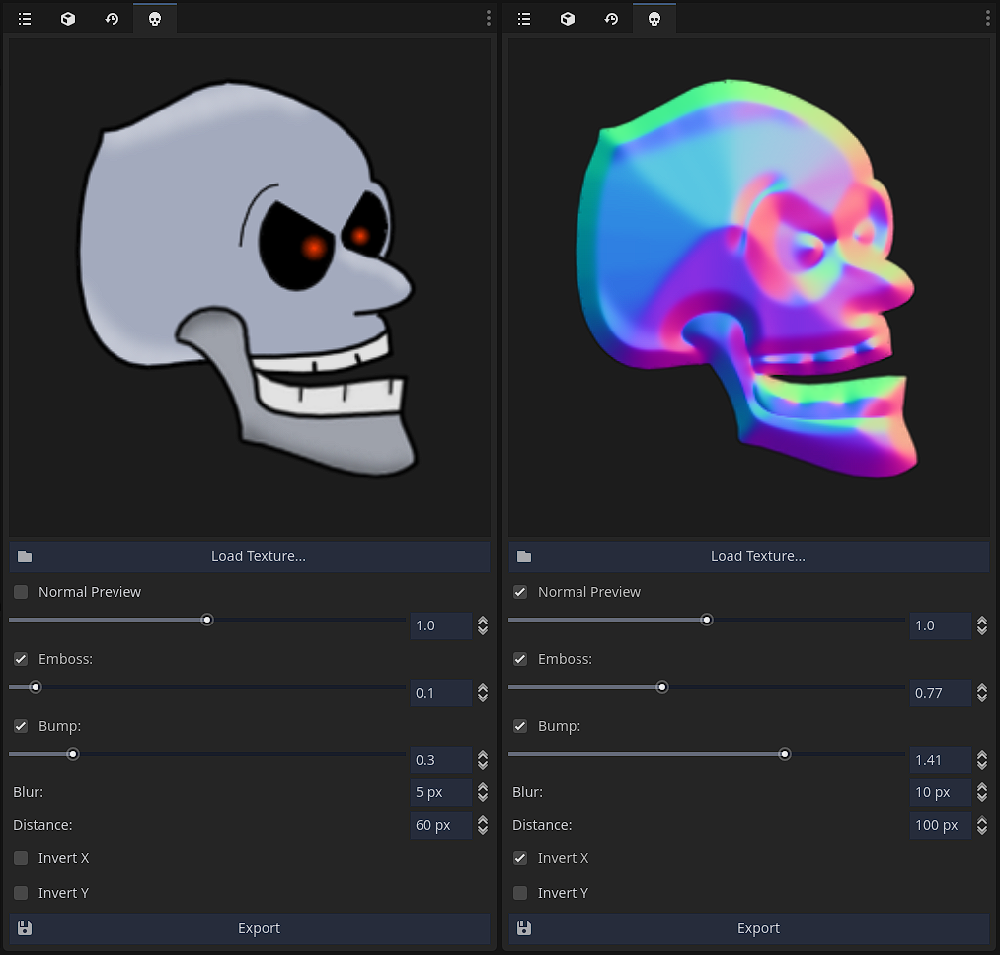

# Normal Map Generator Plugin for Godot 4.4

*Note: This is a work in progress. Many improvements are needed. For better normal map generation, please use [Laigter](https://azagaya.itch.io/laigter). Its also free and opens source, and offers more advanced features.*

This plugin creates a dock that allows you to open a texture and generate a normal map for it by adjusting a few controls. The normal map is exported to the same directory as the original texture, with a "*_n.png" prefix.

This version has been adapted for the new APIs and features introduced in Godot 4.

## Contribute

If you're familiar with Godot and would like to help, any assistance is welcome, especially with improving the GUI.

## Credit

Special thanks to Azagaya for developing the original plugin. You can support them by checking out their [Itch](https://azagaya.itch.io) or their [GitHub](https://github.com/azagaya).

## Preview

